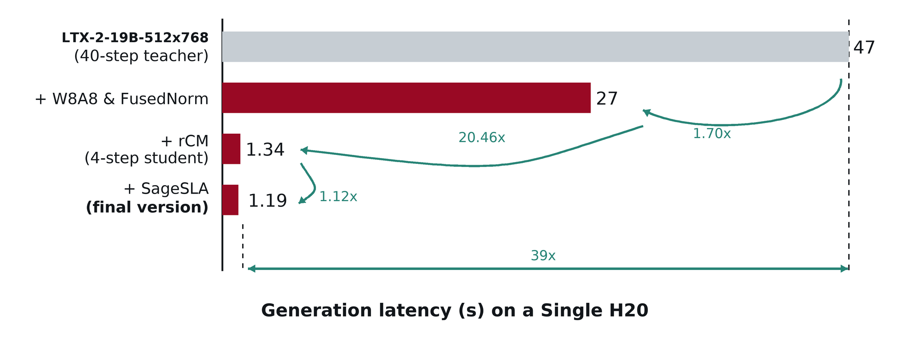

<div align="center">

# TurboT2AV

Fast text-to-audio-video generation distilled from LTX-2 19B.

</div>

## TurboDiffusion-Style Acceleration Decomposition

The figure below follows the same staged view as TurboDiffusion's latency
breakdown, but removes the CPU-offload stage because the H20 used here has
enough memory for the full model. The `+ rCM` row corresponds to the distilled
4-step TurboT2AV student; the final row then adds SageSLA on top of that student.



The measured stages are:

| Resolution | Stage | Latency | Speedup vs previous | Speedup vs teacher | What changes |
| --- | --- | ---: | ---: | ---: | --- |
| `512x768` | LTX-2-19B-512x768<br>(40-step teacher) | 46.48s | - | 1.00x | Full teacher baseline. |
| `512x768` | + W8A8 & FastNorm | 27.32s | 1.70x | 1.70x | TileLang W8A8 Linear and FastNorm with default dense attention. |
| `512x768` | + 4-step student | 2.47s | 11.07x | 18.83x | Distilled TurboT2AV student, still using default dense attention. |
| `512x768` | + SageSLA final | 1.19s | 2.07x | 39.04x | Student plus SageSLA `topk=0.3`, W8A8/FastNorm, text trimming, and helper fusions. |

## Overview

TurboT2AV generates synchronized audio-video from text prompts in 4 steps.
The demo compares the 40-step teacher with the 4-step student.
This repository provides single-GPU inference for the distilled checkpoint.
On an NVIDIA H20, previous benchmark logs report about 55 seconds/video
generator time for the 40-step teacher, about 2.53 seconds/video for the
default 4-step student, and about 2.17 seconds/video with optional
SageAttention + FastNorm inference acceleration.
Training code and the full data-processing pipeline are coming soon.

Main contributions:

- Combines the diversity of consistency models (DCM/SCM) with the high
  perceptual quality of score-model distillation (DMD), taking advantage of both
  families of methods by using CM as a forward-divergence offline method that
  complements DMD as a reverse-KL on-policy method.
- First extends this combined distillation strategy to a large-scale joint
  audio-video generation model at the 14B-video + 5B-audio scale.

<table>
  <thead>
    <tr>
      <th align="center" width="50%">Teacher (40 steps)</th>
      <th align="center" width="50%">Student (4 steps)</th>
    </tr>
  </thead>
  <tbody>
    <tr>
      <td align="center" width="50%"><video src="https://github.com/user-attachments/assets/116d8f07-96a3-4a68-b0bd-fb03eb385269" alt="teacher_p5" width="100%" controls></video></td>
      <td align="center" width="50%"><video src="https://github.com/user-attachments/assets/2b0509e0-216c-4575-ad03-d183a673a9ec" alt="student_p5" width="100%" controls></video></td>
    </tr>
    <tr>
      <td align="center" width="50%"><video src="https://github.com/user-attachments/assets/e5330419-2147-48a9-9225-03113c6d1488" alt="teacher_p6" width="100%" controls></video></td>
      <td align="center" width="50%"><video src="https://github.com/user-attachments/assets/9bbbf2ad-b16a-42ea-b63d-2faf1ef0abb2" alt="student_p6" width="100%" controls></video></td>
    </tr>
    <tr>
      <td align="center" width="50%"><video src="https://github.com/user-attachments/assets/3a7e87b7-5c72-496c-9e6c-205e1ad31bb5" alt="teacher_p73" width="100%" controls></video></td>
      <td align="center" width="50%"><video src="https://github.com/user-attachments/assets/eb21d65c-3bf9-4999-b73d-6c1f825f1549" alt="student_p73" width="100%" controls></video></td>
    </tr>
    <tr>
      <td align="center" width="50%"><video src="https://github.com/user-attachments/assets/f04e2e34-b503-4557-8700-18ce5a058ff9" alt="teacher_p79" width="100%" controls></video></td>
      <td align="center" width="50%"><video src="https://github.com/user-attachments/assets/24ba0beb-f362-4e13-8b03-cac9f63a5410" alt="student_p79" width="100%" controls></video></td>
    </tr>
    <tr>
      <td align="center" width="50%"><video src="https://github.com/user-attachments/assets/820cd365-1737-4126-89aa-af9b120a0c22" alt="teacher_p92" width="100%" controls></video></td>
      <td align="center" width="50%"><video src="https://github.com/user-attachments/assets/de460bd2-c41a-4888-ad0c-735d0358787b" alt="student_p92" width="100%" controls></video></td>
    </tr>
    <tr>
      <td align="center" width="50%"><video src="https://github.com/user-attachments/assets/32bba4ef-ebd2-4a58-a574-352f22ba64b9" alt="teacher_p99" width="100%" controls></video></td>
      <td align="center" width="50%"><video src="https://github.com/user-attachments/assets/1cb3b685-b4cf-4455-b421-623a7ccb39c0" alt="student_p99" width="100%" controls></video></td>
    </tr>
    <tr>
      <td align="center" width="50%"><video src="https://github.com/user-attachments/assets/59a77c01-e237-4cdc-8099-c8cd2e364b70" alt="teacher_p165" width="100%" controls></video></td>
      <td align="center" width="50%"><video src="https://github.com/user-attachments/assets/f692a251-0f63-48eb-a51e-cdb0deaedcd7" alt="student_p165" width="100%" controls></video></td>
    </tr>
  </tbody>
</table>

## 1. Setup

```bash
cd TurboDiffusion/TurboT2AV/LTX-2
pixi install
pixi run install-local
```

Optional inference acceleration uses SageAttention/SageSLA plus
TurboDiffusion's fused norm kernels. The fastest measured path additionally
uses TileLang W8A8 Linear replacement for transformer GEMMs.

```bash
pixi run install-sageattention
```

This installs SageAttention from the upstream source tree because PyPI only
publishes the older 1.0.x series. The task uses `--no-build-isolation` because
SageAttention imports the already-installed PyTorch package during setup. To
use a local checkout, set `SAGEATTENTION_PACKAGE=/path/to/SageAttention`
before running the task.

For SageSLA, also install SpargeAttn:

```bash
pixi run install-spargeattn
```

To use a local checkout, set `SPARGEATTN_PACKAGE=/path/to/SpargeAttn` before
running the task.

Recommended TileLang W8A8 Linear acceleration uses TileLang:

```bash
pixi run install-tilelang
```

Experimental compiled W8A8 Linear acceleration can also use torchao:

```bash
pixi run install-torchao
```

FastNorm and SLA are loaded from the parent TurboDiffusion checkout. If
TurboT2AV is not checked out inside TurboDiffusion, add TurboDiffusion to
`PYTHONPATH` before running accelerated inference:

```bash
export PYTHONPATH=/path/to/TurboDiffusion:/path/to/TurboDiffusion/turbodiffusion:$PYTHONPATH
```

`--attention_type sagesla` additionally requires TurboDiffusion's SLA module
and the SpargeAttn/SageSLA extension to be installed in the active Python
environment. Without an SLA adapter checkpoint, TurboDiffusion's `proj_l`
compensation layer is zero-initialized, matching the plug-in inference path.

## 2. Download Weights

| Model Name | Checkpoint Link |
| --- | --- |
| TurboT2AV-14BVideo-5BAudio | [Hugging Face Model](https://huggingface.co/luyu1021/turbo-t2av) |
| LTX-2-19B | [Hugging Face Model](https://huggingface.co/Lightricks/LTX-2) |
| Gemma-3-12B-IT-QAT-Q4_0 | [Hugging Face Model](https://huggingface.co/google/gemma-3-12b-it-qat-q4_0-unquantized) |

Gemma is a gated Hugging Face model. Before downloading, visit the model page,
accept the access terms, and export a Hugging Face token with access permission:

```bash
export HF_TOKEN=your_huggingface_token
```

Base model weights:

```bash
hf download Lightricks/LTX-2 ltx-2-19b-dev.safetensors --local-dir /path/to/checkpoints/LTX-2
hf download google/gemma-3-12b-it-qat-q4_0-unquantized --local-dir /path/to/checkpoints/gemma-3-12b-it-qat-q4_0-unquantized
```

Distilled checkpoint:

```bash
hf download luyu1021/turbo-t2av checkpoints/scm_dmd_checkpoint_001000/model.pth --local-dir /path/to/checkpoints
```

## 3. Run Inference

Set environment variables:

```bash
export TURBO_CHECKPOINT_PATH=/path/to/ltx-2-19b-dev.safetensors
export TURBO_GEMMA_PATH=/path/to/gemma-3-12b-it-qat-q4_0-unquantized
```

### Student (4 steps, full acceleration)

```bash
cd LTX-2
PYTHONPATH=/path/to/TurboDiffusion:/path/to/TurboDiffusion/turbodiffusion:packages/ltx-distillation/src:packages/ltx-core/src:packages/ltx-pipelines/src:$PYTHONPATH \
  CUDA_VISIBLE_DEVICES=0 \
  pixi run python -m ltx_distillation.tools.run_av_inference_eval \
  --config_path packages/ltx-distillation/configs/bidirectional_rcm.yaml \
  --prompts_file /path/to/prompts.csv \
  --output_dir /path/to/student_accelerated_output \
  --model_kind student \
  --student_checkpoint /path/to/checkpoint.pt \
  --student_param auto \
  --num_prompts 8 \
  --attention_type sagesla \
  --attention_scope self \
  --sla_topk 0.3 \
  --fast_norm \
  --quant_linear \
  --quant_linear_scope all \
  --quant_linear_backend tilelang_postscale
```

`--attention_scope self` replaces video/audio self-attention only. Masked text
cross-attention stays on the native backend because SageAttention/SageSLA does
not support the LTX text mask path here. For timing-only comparisons, add
`--skip_decode --timing_json /path/to/timing.json`.

### Teacher (40 steps)

```bash
cd LTX-2
PYTHONPATH=packages/ltx-distillation/src:packages/ltx-core/src:packages/ltx-pipelines/src:$PYTHONPATH \
  CUDA_VISIBLE_DEVICES=0 \
  pixi run python -m ltx_distillation.tools.run_av_inference_eval \
  --config_path packages/ltx-distillation/configs/bidirectional_rcm.yaml \
  --prompts_file /path/to/prompts.csv \
  --output_dir /path/to/teacher_output \
  --model_kind teacher \
  --teacher_mode native_rf \
  --teacher_steps 40 \
  --num_prompts 8
```

`--sla_topk 1.0` is the quality-first dense-block default for TurboT2AV.
Lower values such as `0.8`, `0.6`, `0.4`, or `0.3` are faster on long video
sequences, but they change generated content more visibly because SLA is a
sparse-linear attention approximation, not a numerically equivalent
dense-attention kernel. The current speed/quality tradeoff used for the H20
figures is `--sla_topk 0.3`.

For finer control, `--sla_topk_schedule` can set different top-k ratios by
transformer layer. Unmatched layers fall back to `--sla_topk`:

```bash
--sla_topk 0.3 --sla_topk_schedule 0-15:0.35,16-31:0.3,32-47:0.25
```

This is useful when early layers need denser attention for quality while later
layers can use a more aggressive sparse pattern for speed. In 512x768 H20
tests, layer schedules only improved generator time by about 1% over uniform
`topk=0.3`, so uniform `topk=0.3` remains the recommended default unless a
target workload validates a better schedule.

### Experimental W8A8 Linear Quantization

W8A8 is available as an opt-in experiment:

```bash
--quant_linear --quant_linear_scope all --quant_linear_backend tilelang_postscale
```

`--quant_linear_scope all` matches the broad TurboDiffusion-style replacement,
`ffn` targets all transformer feed-forward Linear layers, `video_ffn` targets
only video feed-forward Linear layers, `audio_ffn` targets only audio
feed-forward Linear layers, and `non_attention` skips attention projection
layers. The recommended H20 backend is `tilelang_postscale`, which stores W8
weights once and dynamically quantizes activations to A8 before a TileLang INT8
GEMM.

To make a strict TurboDiffusion-style prequantized checkpoint, first save a
student state dict whose selected Linear layers already contain `int8_weight`
and `scale` buffers:

```bash
python -m ltx_distillation.tools.prequantize_av_student \
  --student_checkpoint /path/to/model.pth \
  --output_path /path/to/model_w8a8_video_ffn_prequant.pth \
  --quant_linear_scope video_ffn
```

Then load it with:

```bash
--quant_linear_prequantized --quant_linear_scope video_ffn
```

`--quant_linear_backend turbodiffusion` uses TurboDiffusion's strict
`Int8Linear` kernel. In strict mode the selected weights are stored once as
`int8_weight` plus `scale` buffers, and each forward uses TurboDiffusion
`quant_cuda` for A8 activation quantization followed by
`gemm_cuda_swizzle_bias`. This is not fake quantization and it does not
recompress weights on every forward, but the strict backend was slower than
BF16 cuBLASLt for TurboT2AV's H20 FFN shapes. The integrated speed path uses
`tilelang_postscale` instead.

FFN layers are large dense `W*x+b` GEMMs, so INT8 can reduce weight bandwidth
and GEMM cost. Attention projection layers also contain GEMMs, but the
attention block is dominated by QKV reshaping, layout changes, softmax/masking,
and KV reads, so quantizing those projections is less likely to improve
end-to-end runtime. TurboDiffusion W8A8 is not enabled by default. The compiled
torchao backend is also not default because it adds a dependency and a
first-sample compile cost.

H20 generator-only measurements use `--skip_decode`, one common warmup sample,
121 frames, and the same student checkpoint. The current recommended stack is
SageSLA self-attention with `topk=0.3`, FastNorm, text-context trimming, fused
Ada/RoPE helpers, and TileLang post-scale W8A8 Linear.

| Resolution | Path | Median generator time | Speedup vs pure default | Notes |
| --- | --- | ---: | ---: | --- |
| `512x768` | pure default | 2.468s/video | 1.00x | No TurboDiffusion acceleration. |
| `512x768` | SageSLA `topk=0.3` + FastNorm + TileLang W8A8 | 1.19s/video | 2.07x | 96 self-attention modules and 1370 Linear modules replaced. |
| `1024x1792` | pure default | 16.70s/video | 1.00x | Stress-test resolution; video latent is `[1,16,128,32,56]`. |
| `1024x1792` | SageSLA `topk=0.3` + FastNorm + TileLang W8A8 | 5.82s/video | 2.87x | Quality/speed tradeoff used for visual checks. |
| `1024x1792` | SageSLA `topk=0.2` + FastNorm + TileLang W8A8 | 5.50s/video | 3.04x | Faster, with more sparse attention approximation. |

SageSLA affects quality because it sparsifies self-attention. Earlier decoded
visual checks showed `topk=0.3` is the safer high-resolution tradeoff, while
`topk=0.2` is useful when speed is prioritized. Lower top-k values should be
rechecked visually for the target prompt distribution.

Component-level H20 validation:

| Component | Shape / setting | Dense or BF16 baseline | Accelerated path | Speedup |
| --- | --- | ---: | ---: | ---: |
| Self-attention | `512x768`, 6144 video tokens | SDPA 1.798ms | SageSLA `topk=0.3` 0.983ms | 1.83x |
| Self-attention | `512x768`, 6144 video tokens | SDPA 1.798ms | SageSLA `topk=0.2` 0.915ms | 1.97x |
| Self-attention | `1024x1792`, 28672 video tokens | SDPA 37.70ms | SageSLA `topk=0.3` 7.818ms | 4.82x |
| Self-attention | `1024x1792`, 28672 video tokens | SDPA 37.70ms | SageSLA `topk=0.2` 6.229ms | 6.05x |
| TileLang W8A8 GEMM | `M=28672,N=16384,K=4096` | BF16 5.281ms | W8A8 + A8 quant 3.375ms | 1.56x |
| TileLang W8A8 GEMM | `M=28672,N=4096,K=16384` | BF16 5.456ms | W8A8 + A8 quant 3.397ms | 1.61x |
| TileLang W8A8 GEMM | `M=6144,N=16384,K=4096` | BF16 1.096ms | W8A8 + A8 quant 0.774ms | 1.42x |
| TileLang W8A8 GEMM | `M=6144,N=4096,K=16384` | BF16 1.012ms | W8A8 + A8 quant 0.650ms | 1.56x |

The strict TurboDiffusion `Int8Linear` backend precompresses weights correctly,
but was slower than BF16 cuBLASLt on this H20 setup for TurboT2AV FFN shapes.
The integrated W8A8 path therefore uses the TileLang post-scale kernel, which
keeps INT8 accumulation continuous over K and applies activation/weight scales
in the epilogue. Text K/V caching was also tested as an experimental switch
(`TURBOT2AV_CACHE_TEXT_KV=1`), but it did not change measured generator time and
is off by default.

`--prompts_file` supports CSV (`video_id,prompt`) or plain text (one prompt per line).

Outputs are saved under the requested `--output_dir` with separate subfolders:
`video/` for MP4 files, `audio/` for WAV files, and `json/` for prompt metadata.
